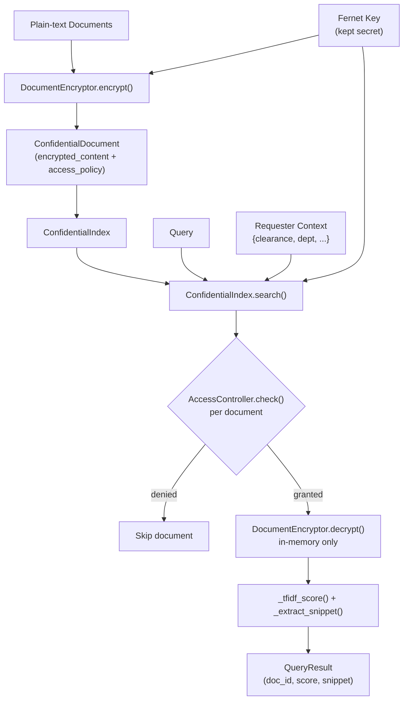

# aumai-confidentialrag

TEE-based privacy-preserving RAG. Run retrieval-augmented generation over encrypted documents,
enforcing attribute-based access control, so plaintext never leaves the trusted execution
boundary.

[](https://github.com/aumai/aumai-confidentialrag/actions)
[](https://pypi.org/project/aumai-confidentialrag/)
[](LICENSE)

> **SR-6 — Scope-Reduced project.** The public API implements the confidential compute pattern
> with symmetric encryption and attribute-based access control. Hardware TEE integration
> (Intel TDX / AMD SEV attestation) is handled by the enterprise layer.

---

## What Is This?

Retrieval-augmented generation (RAG) solves the "stale knowledge" problem in LLMs by injecting
relevant documents at query time. But standard RAG has a critical privacy gap: documents are
stored and searched in plaintext. Any breach of the vector store — or the inference host — leaks
all your data.

`aumai-confidentialrag` closes that gap by keeping every document encrypted at rest. When a
query arrives, decryption happens in-memory only (simulating the trusted execution boundary),
scoring is performed on plaintext, and the ciphertext is never persisted in decrypted form.
Before any document can be decrypted for a query, the requester's attributes must satisfy the
document's access policy.

The analogy: imagine a librarian locked inside a vault. You slide a question through a slot.
The librarian reads the books (which exist only inside the vault), writes the relevant passages
on a note, and slides it back. You never enter the vault. The books never leave the vault.

### Key capabilities

- **Fernet authenticated encryption** (AES-128-CBC + HMAC-SHA256) for all document content
- **Attribute-based access control (ABAC)** — per-document policies evaluated against requester
  context before any decryption attempt
- **TF-based relevance scoring** performed on transiently decrypted plaintext
- **Context-aware snippet extraction** centered around the first matching query term
- **CLI workflow** from plaintext corpus to searchable encrypted index in two commands

---

## Why Does This Matter?

### The RAG privacy problem

A standard RAG pipeline looks like this:

```
documents (plaintext) --> vector store --> retriever --> LLM
```

Every component in this chain sees your documents in plaintext. The vector store operator,
the retrieval API host, the LLM API provider — all are in-scope for a data breach. For
regulated industries (healthcare, finance, legal, government) this is often disqualifying.

### The TEE pattern

A Trusted Execution Environment is a hardware-isolated enclave — Intel TDX, AMD SEV, or ARM
TrustZone — where code runs with cryptographic attestation that the host OS and hypervisor
cannot read enclave memory. The TEE pattern for RAG is:

1. Documents are encrypted before leaving your control.
2. The decryption key is sealed to the enclave.
3. Retrieval scoring happens inside the enclave on transiently decrypted text.
4. Only the scored snippets leave the enclave — never the raw documents.

`aumai-confidentialrag` implements this pattern in software, making it possible to develop,
test, and integrate the access control and encryption logic before binding to specific TEE
hardware.

---

## Architecture



---

## Features

- Fernet symmetric encryption with authenticated decryption (`cryptography` library)
- Static `generate_key()` method for key generation
- Per-document `access_policy` dict evaluated by `AccessController` before decryption
- TF-based relevance scoring normalized to [0, 1]
- Query snippet extraction centered on first matching term with configurable length
- CLI: `keygen`, `encrypt` (batch encrypt a directory), `search`
- Pydantic v2 models for all data structures
- `ConfidentialIndex` supports add, remove, get, search, and document count operations
- Graceful handling of wrong-key or corrupted ciphertext (`InvalidToken` → document skipped)

---

## Installation

```bash
pip install aumai-confidentialrag
```

**Requirements:** Python 3.11+

---

## Quick Start

### 1. Generate an encryption key

```bash
aumai-confidentialrag keygen --output my.key
```

```
Key written to my.key
IMPORTANT: Keep this key secret and backed up.
```

### 2. Encrypt a directory of documents

```bash
aumai-confidentialrag encrypt \
  --input ./plaintext-docs \
  --output ./encrypted-index \
  --key my.key \
  --key-id prod-2025-q1
```

```
Encrypted 47 document(s) to encrypted-index/
```

### 3. Search the encrypted index

```bash
aumai-confidentialrag search \
  --query "data retention policy" \
  --index ./encrypted-index \
  --key my.key \
  --top-k 3 \
  --context '{"clearance":"internal","department":"legal"}'
```

```
Top 3 result(s) for query: 'data retention policy'

[1] doc_id=a3f2...  score=0.0412
    '...data retention policy requires all records older than seven years...'

[2] doc_id=b9c1...  score=0.0287
    '...retention schedules must comply with the applicable policy framework...'

[3] doc_id=7e4a...  score=0.0201
    '...policy amendment effective Q1 2026 affects data stored in...'
```

---

## CLI Reference

### `aumai-confidentialrag keygen`

Generate a new Fernet encryption key and write it to a file.

| Option | Default | Description |
|--------|---------|-------------|
| `--output PATH` | `confidential.key` | Path to write the key bytes |

The key is 32 bytes of URL-safe base64-encoded random data. Treat it like a private key —
back it up securely. Loss of the key means permanent loss of all encrypted documents.

### `aumai-confidentialrag encrypt`

Recursively encrypt all files in a directory, writing one JSON file per document.

| Option | Required | Default | Description |
|--------|----------|---------|-------------|
| `--input PATH` | yes | — | Directory of plaintext documents |
| `--output PATH` | yes | — | Directory for encrypted JSON files |
| `--key PATH` | no | `confidential.key` | Fernet key file |
| `--key-id TEXT` | no | `default` | Logical key identifier stored in metadata |

Each output file is a `ConfidentialDocument` JSON with a fresh UUID as `doc_id`.

### `aumai-confidentialrag search`

Search an encrypted index directory.

| Option | Required | Default | Description |
|--------|----------|---------|-------------|
| `--query TEXT` | yes | — | Plaintext search query |
| `--index PATH` | yes | — | Directory of encrypted JSON files |
| `--key PATH` | no | `confidential.key` | Fernet key file |
| `--top-k INT` | no | `5` | Maximum results to return |
| `--context JSON` | no | `{}` | Requester attribute context for ABAC |

---

## Python API

### Encrypting a document

```python
from aumai_modeloci.core import DocumentEncryptor  # noqa — illustrative only
from aumai_confidentialrag.core import DocumentEncryptor
from aumai_confidentialrag.models import ConfidentialDocument

key = DocumentEncryptor.generate_key()
encryptor = DocumentEncryptor()

ciphertext = encryptor.encrypt("Quarterly financial projections...", key)

doc = ConfidentialDocument(
    doc_id="fin-q1-2025",
    encrypted_content=ciphertext,
    metadata={"source": "finance/q1.txt"},
    access_policy={"clearance": "confidential", "department": "finance"},
)
```

### Decrypting a document

```python
plaintext = encryptor.decrypt(doc.encrypted_content, key)
print(plaintext[:80])
```

### Building and searching an index

```python
from aumai_confidentialrag.core import AccessController, ConfidentialIndex

index = ConfidentialIndex(access_controller=AccessController())
index.add_document(doc)

results = index.search(
    query="financial projections",
    key=key,
    top_k=5,
    requester_context={"clearance": "confidential", "department": "finance"},
)

for result in results:
    print(result.doc_id, result.relevance_score, result.decrypted_snippet)
```

### Access control without search

```python
from aumai_confidentialrag.core import AccessController

controller = AccessController()

policy = {"clearance": "secret", "department": "research"}
user = {"clearance": "secret", "department": "research", "role": "analyst"}

print(controller.check(policy, user))          # True
print(controller.check(policy, {"role": "guest"}))  # False
```

### Managing the index

```python
# Add multiple documents
for document in batch:
    index.add_document(document)

# Check count
print(index.document_count())

# Retrieve by ID
doc = index.get_document("fin-q1-2025")

# List all IDs
ids = index.all_doc_ids()

# Remove a document
index.remove_document("fin-q1-2025")
```

---

## Configuration Reference

### `EncryptionConfig` fields

| Field | Type | Default | Description |
|-------|------|---------|-------------|
| `algorithm` | `str` | `"fernet"` | Encryption algorithm label |
| `key_id` | `str` | — | Logical key identifier for audit trails |

### `ConfidentialDocument` fields

| Field | Type | Required | Description |
|-------|------|----------|-------------|
| `doc_id` | `str` | yes | Unique document identifier |
| `encrypted_content` | `str` | yes | URL-safe base64 Fernet ciphertext |
| `metadata` | `dict[str, Any]` | no | Arbitrary metadata (never encrypted) |
| `access_policy` | `dict[str, Any]` | no | Required attribute key-value pairs for access |

### `QueryResult` fields

| Field | Type | Constraints | Description |
|-------|------|-------------|-------------|
| `doc_id` | `str` | — | Matching document ID |
| `relevance_score` | `float` | [0.0, 1.0] | Normalized TF-based relevance score |
| `decrypted_snippet` | `str \| None` | — | Plaintext excerpt centered on query terms |

---

## How It Works

### Encryption

`DocumentEncryptor` wraps the `cryptography.fernet.Fernet` class. Fernet provides:

- AES-128 in CBC mode for confidentiality
- HMAC-SHA256 for authenticated integrity
- URL-safe base64 encoding of the ciphertext token
- Automatic timestamp in the token (enabling key expiration, if desired)

The output is a string token that is safe to store in JSON files and transmit over ASCII
channels.

### Access control

`AccessController.check(policy, context)` is a pure function implementing attribute-based
access control. The policy is a dict of required key-value pairs. The requester context must
contain matching values for all required keys. An empty policy grants unrestricted access.
This model supports role hierarchies, clearance levels, departmental segmentation, and any
other attribute-based scheme expressible as key-value pairs.

### Search scoring

`ConfidentialIndex.search` iterates over all documents. For each document:

1. The access policy is evaluated. If the requester context fails, the document is skipped.
2. The document is decrypted in-memory using the provided key. If the key is wrong or the
   ciphertext is corrupted, the `InvalidToken` exception is caught and the document is skipped.
3. A TF-based score is computed: for each query term, term frequency = count / doc_length.
   The total TF across all query terms is divided by the number of query terms to normalize
   to [0, 1].
4. Documents with a score > 0 are collected, sorted descending, and the top-k are returned
   with a context snippet.

The decrypted plaintext exists only in local variables during the scoring loop — it is never
written back to storage.

### Snippet extraction

The snippet extractor finds the earliest position of any query term in the document, then
extracts a window of `_SNIPPET_LENGTH` (200) characters centered on that position, with `...`
ellipsis markers when the window does not reach the document boundaries.

---

## Integration with Other AumAI Projects

| Project | Integration |
|---------|-------------|
| **aumai-specs** | Define access policy schemas as specs; validate `ConfidentialDocument` at ingest time |
| **aumai-modeloci** | Package encrypted index directories as OCI artifacts for versioned distribution |
| **aumai-greenai** | Track energy consumption of batch encryption and search operations |

---

## Contributing

See [CONTRIBUTING.md](CONTRIBUTING.md). All contributions require passing `make lint` (ruff +
mypy strict) and `make test`. Conventional commit messages required.

## License

Apache 2.0 — see [LICENSE](LICENSE).
